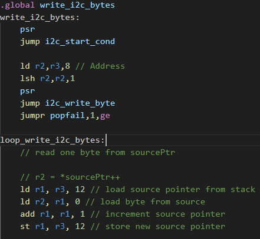

# ESP32 ULP coprocessor assembly highlighting for Visual Studio Code

Adds syntax highlighting for the ESP32 ULP assembly language to Visual Studio Code. This extension was written after spending a week trying to write I2C sw driver in black and white. It is directly based on [ESP32 ULP Documentation](https://docs.espressif.com/projects/esp-idf/en/stable/esp32/api-reference/system/ulp_instruction_set.html)

## Screenshot

## Note
This extension used the [VsCode-ARM](https://github.com/dan-c-underwood/vscode-arm) as a starting template. Thank you.